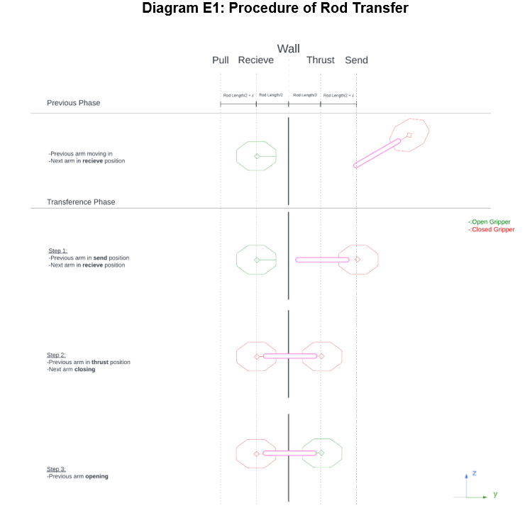

# CoppeliaSim Exploration: Multi-Robot Coordination for Nuclear Rod Transfer

## Aim
The aim of the simulation is to find ways to safely transport fuel rods with the use of multiple robotic manipulators under different scenarios.  A spectrum of scenarios is used as nuclear facilities may undergo modifications or upgrades over time, leading to changes in positions where the fuel rods are transferred among the robots. Moreover, in the event of an emergency or unexpected situation, the robots should be able to detect the changes in the environment and carry out the best course of action to complete its task, for failure of handling such dangerous fuel rods would lead to disastrous outcomes.

## Objective
To develop and test the robots’ ability to adapt to changes in the environment, a simulation is created in CoppeliaSim where four Nyrio-1 robotic arms equipped with short distant proximity ray sensors are placed in equidistant, separated by 3 walls each having a singular hole.  In every trial, only one of the 9 holes is randomly generated on the wall, while the remaining eight are blocked.

The first robotic arm shall pick up a rod from a raised holder, rotate to the opposite direction and pass the rod to the next arm through the hole after the latter has scanned through the 9 positions and located the hole on the wall, which is randomly assigned for every transference.  The process is then repeated until the last arm deposits the rod into a receptacle, which unloads the rod onto a conveyor belt.  The belt then proceeds to transport the rod back to its original position such that the simulation can continue to run as an endless cycle to simulate different scenarios for the robots to carry out their tasks.

Overview of setup:

## Spatial Setup
The Nyrio-1 arm is 0.374m tall and 0.356m long in resting position and can reach a distance of 0.556m when fully extended.  With 6 rotational joints of 1 degree of freedom(DOF) each, the robotic arm has a total of 6 DOF.  Meanwhile, the rod is 0.2m in length and 0.02m in radius, while the thin walls are 0.6m x 0.6m in dimension, with 9 holes of 0.05m radius equidistant from one another in a 3x3 formation.  Considering the range of motion of the robot, each wall and arm are separated by 0.42m in length such that the robots can reach the walls with ease while remaining free to rotate while possessing the rod within the confined space.

Dimensions of simulated objects:

Overview of simulation setup:

## Random Hole Generation
To simulate an unpredictable environment and test the robots’ abilities to adapt, prior to each rod transfer, one hole on each wall is randomly assigned to be open while the other 8 remain closed. The locations of the holes are updated after every rod transfer process, creating up to (9x9x9) 729 distinct scenarios with (9+81+81+9) 180 distinct transfer paths.  Under each scenario, the robot has to identify the position of the hole and communicate with one another autonomously to plan their paths, showcasing a certain level of intelligence.  The locations of the holes are identified by numbers in columns and rows, such that the robots can easily identify its position relative to the starting and ending positions for more efficient path planning.

## Inverse Kinematics
The control of specific arm motions of the robot within the simulation involves inverse kinematics(IK), which allows the robot to calculate its joint angles needed for reaching a desired position.  This allows the user to control the end effectors of the robot and carry out their tasks, in this scenario, to reach and collect a singular rod.  CoppeliaSim has its own IK plugin API reference with tutorials on how to implement inverse kinematics to a robotic arm such that the end effectors of the robot would follow a designated target automatically[1].  However, by applying such an algorithm alone, the robot would either fail to generate a solution for the path it is required to reach the rod, or simply translocate to its final position instantly without rotating in order to reach its moderately distant target.

In order to effectively utilise the provided IK algorithm when the target is extremely close to the arm’s end effectors, the target dummy was set at the position of the robot’s grippers which the robot can continuously track.  The dummy would then rotate and move to its desired position in a linear motion and at a constant speed with the robot’s grippers following behind, being guided to the actual target.  This has been the main strategy to control the robots and is further refined by adding multiple dummy points into the simulation, acting as checkpoint nodes, such that the robots could perform various poses during different stages of the process.

Diagram showing how the arm follows the desired track:

Multiple dummy points for pathfinding:

## Ray Proximity Sensors:
Proximity sensors are installed onto the grippers of 3 robots such that they are able to scan the walls ahead in order to identify the location of the randomly opened hole.  For simplicity's sake, the ray sensor was set with a range of 0.2m ,which is longer than the distance between the robot’s gripper and the wall. Since the positions of the 9 possible holes were predefined, the robot would only use its sensors to determine the hole’s presence when it has reached the potential position of the hole.   Despite not having to search for holes on a wall, a ray type proximity sensor is also installed onto the holder of the rod to signal the first arm and start the transfer procedure.

## Reset System:
As the fourth robot has deposited the rod into the receptacle and finished the entire transfer process, the receptacle would unload the transferred rod onto a still conveyor belt, which then activates and transports the rod back to its original position to restart the transfer cycle.  A block is placed slightly behind the position where the rod is expected to be deposited to secure its position against any slippage

## Finite State Machine
The robots are programmed as finite state machines, with the states being grouped into several phases.  While there are some differences between each robot, their actuation procedures are mostly similar in the following order: scanning phase, transition phase, transfer phase, and reset phase.

Diagram of FSM:

## Scanning procedure
In order for the robot to position its grippers in front of the 9 possible holes on the wall, 9 wall nodes were placed in front of the walls at various orientations and depths based on calculations of geometry, such that the arm can transverse its grippers freely to all 9 positions at a feasible pose.

Upon starting the simulation, the robots would extend their grippers to reach the top left wall node on the receiving wall and scan through the nodes in a snake-like pattern, to search for the hole with its proximity sensor.  On detecting the wall, it would proceed to the next node and repeat the sensing process until it detects a clear path, signifying a hole ahead.  The information would then be relayed across the robots for path planning, allowing the robot to proceed to its next phase and reposition its grippers to the “receive position”.

Geometry of holes to end effector:

Scanning pattern to identify hole position:

Search in action:

##Transition procedure
In order to handle the various starting and ending position scenarios, the robots are programmed to take a generalised path where they would all carry out the same poses before taking the same path and turning to the opposite side, only then would they manoeuvre their grippers to their respective end positions.  This would ensure the robots could transport the rod in a simpler and more consistent manner.

Once the next arm has located the hole on the next wall and has broadcasted the ready signal, the robot in possession of the rod would rotate clockwise to reach the nearest transition node.  They would then level their grippers to the middle level and proceed to rotate and face the targeted wall, where its grippers can manoeuvre to any point on the wall through the wall nodes that were calculated similarly to the ones on the receiving wall.  The robot would then undergo the transfer phase again, acting as the sender.  Once the rod has been transferred to the next robot, it would then enter the reset phase.

Transfer procedure diagram:

Robot rotation diagram(2D):

Robot rotation diagram(3D):

Demo Transfer(Old footage as latest version was lost):

## Results and Discussion
The simulation was in general a success, with the 3 robots successfully manoeuvring their grippers along the wall and locating the holes swiftly and precisely. The 4 robots would then efficiently pass along the rod through said holes to one another with the final robot accurately dropping the rod into the receptacle.  At last the rod is deposited onto the conveyor in the correct orientation such that the rod can be transported back to the original position for another transfer process.
However, the simulation is far from perfect. The robots are programmed assuming the rods are handed to them in perfect orientation and position.  Hence the rod transfer could fail if the receiving gripper could not grab onto the poorly positioned rod it was given.  Besides, the poorly grabbed rod would exceed the length between the gripper and the wall, resulting in the rod occasionally grazing the wall as the arm rotates to the opposite direction.  Furthermore, as the simulation loop goes on, the physics within the simulation would start to break and the instability would cause cases of failure to emerge more frequently.

The objectives of the simulation were demanding.  As the Nyrio-1’s movement is entirely controlled by rotational joints rather than linear ones, it prefers moving in a circular path rather than a linear trajectory.  However, as the target of the arm is programmed to shift towards the checkpoint nodes in a direct route, the IK algorithm could occasionally not solve poses once the target becomes slightly distant, the robot arm would be permanently stuck at certain complicated poses.  Hence, multiple checkpoint nodes are required to create a circular path such that the target has to transverse multiple points before reaching its intended destination, leading the robot to rotate into position sequentially.  Furthermore, with the random hole generation feature, the robot has to handle multiple possible positions per wall to receive the desired object, adding complexity to its path handling.

## Conclusion and Further Work
In conclusion, the 4 simulated Nyrio-1 arms with ray sensors separated by 3 walls with 1 hole each among 9 possible hole positions were able to efficiently pass along the rod in sequence by sensing and reacting to the constantly changing environment as well as communicating to one another, showing a certain level of intelligence when handling the task.  The four robots move by solving inverse kinematics to position its grippers to various different checkpoint nodes placed within the simulation.

That said, the simulation could be further improved by adding failure detections and failsafe systems such that the robots can account for awkward rod positioning as well as detecting whether it has successfully grabbed the rod to avoid failure of transfer.  The IK and pathfinding algorithm could also be further improved for more advanced IK solving and path planning, allowing the robot to achieve more complex poses more efficiently as well as decreasing the chances of the robot getting stuck during transitions.

All in all, the simulation is considered fruitful, as it Demonstrates the robots’ abilities to react to uncertain environments while completing their tasks efficiently.  

## References
[1] CoppeliaSim, “Inverse kinematics tutorial”, Published online at CoppeliaRobotics, Retrieved from: “https://www.coppeliarobotics.com/helpFiles/en/inverseKinematicsTutorial.htm” [Online Resource]
